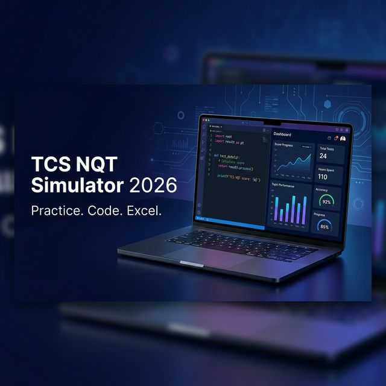
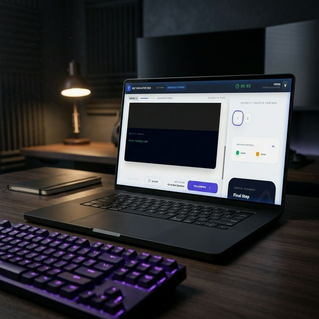

# 🚀 TCS NQT Simulator 2026

> A "Job-Ready" Full-Stack Simulation Platform to Ace the TCS National Qualifier Test.



[](https://mongodb.com)
[](https://judge0.com)

## ✨ Features

- ⏳ **Clock-Precision Timers**: Realistic section-wise time-locking as per the actual 2026 NQT pattern.
- 💻 **Integrated Code Sandbox**: Run Python, C++, and Java solutions in real-time with Judge0 integration.
- 🎯 **Practice Hub**: Targeted preparation for Numerical, Reasoning, Verbal, and Coding abilities.
- 📊 **Performance Analytics**: Deep-dive into accuracy, time taken, and score trends on a premium dashboard.
- 💾 **State Persistence**: Auto-save progress and session restoration—pick up exactly where you left off.

## 📸 Screenshots

| Dashboard | Coding Portal |
| :---: | :---: |
|  |  |

## 🛠️ Tech Stack

- **Frontend**: React 18, Vite, Lucide React, Monaco Editor, Vanilla CSS.
- **Backend**: Node.js, Express.js, JWT Authentication.
- **Database**: MongoDB Atlas with Mongoose ODM.
- **Infrastructure**: Render (Blueprint Deployment), Judge0 API (RapidAPI).

## 🚀 Live Demo

[Visit the Simulator](https://tcs-nqt-frontend.onrender.com)

## 📦 Installation

1. **Clone the repo:**
   ```bash
   git clone https://github.com/Veerasuryahub/tcs-nqt-simulator.git
   ```

2. **Frontend Setup:**
   ```bash
   cd frontend
   npm install
   npm run dev
   ```

3. **Backend Setup:**
   ```bash
   cd backend
   npm install
   # Add your .env variables (MONGODB_URI, JWT_SECRET, JUDGE0_API_KEY)
   npm start
   ```

## 🤝 Contribution

Feel free to fork this project and submit a PR! For major changes, please open an issue first to discuss what you would like to change.
